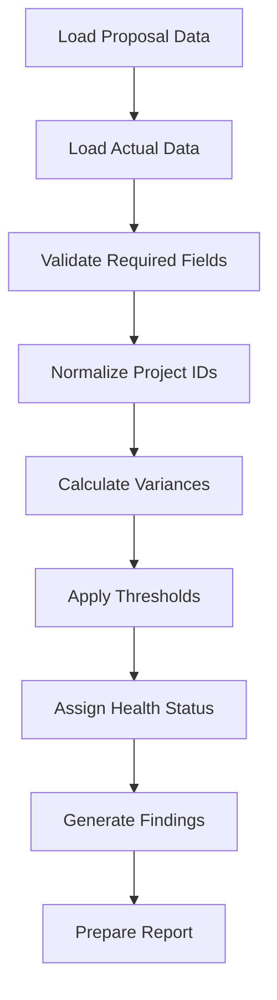

# Audit Engine Foundation

## Why The Audit Engine Comes First

The project should not begin with the interface. It should begin with the audit logic.

The purpose of the audit engine is to define how project performance will be judged. Once that logic is reliable, the dashboard and reports can be built around it.

## Audit Scope

The engine audits projects from approval onward: `approved` → `active` → `paused` → `completed`. Proposal data is the comparison baseline, not an audited state. All thresholds come from the versioned Audit Criteria Register (`config/audit_criteria.yaml`), and every run writes a run record for traceability.

## Audit Perspective

The audit should answer four practical questions:

1. What was expected?
2. What actually happened?
3. How far apart are expected and actual performance?
4. What does that difference mean for the project, team, and business?

## Primary Audit Areas

### Budget

The budget audit checks whether the project stayed within its expected financial position.

Key checks:

- Estimated budget versus actual value
- Balance remaining
- Billed percentage
- Change order impact
- Budget usage by project phase

### Hours

The hours audit checks whether the project used labor as expected.

Key checks:

- Estimated hours versus actual hours
- Hours remaining
- Burn rate
- Overtime or special labor usage
- Hours concentration by resource or task type

### Resources

The resource audit checks whether the planned team and actual team usage were aligned.

Key checks:

- Planned resources versus assigned resources
- Resource load
- Role or team mix
- Support needs
- Rework or emergency support patterns

### Rates

The rate audit checks whether labor cost assumptions matched actual labor usage.

Key checks:

- Expected rate versus actual rate
- Team rate differences
- Premium labor usage
- Rate impact on project margin

### Schedule

The schedule audit checks whether the project timeline stayed within the expected path.

Key checks:

- Start date
- End date
- Number of active days
- Pause or hold periods
- Deadline risk
- Schedule variance

### Project Score

The project score combines the audit areas into a simple health view.

Recommended first version:

- Green: project is performing within expected range
- Yellow: project needs attention
- Red: project has material risk or performance gap

Later versions can add a numeric score from 0 to 100.

## Suggested First Metrics

| Area | Metric | Purpose |
|---|---|---|
| Budget | Budget variance percentage | Shows financial gap from expected budget |
| Hours | Hours variance percentage | Shows labor gap from expected effort |
| Billing | Billed percentage | Shows whether billing progress supports project status |
| Balance | Balance remaining percentage | Shows financial room left in the project |
| Schedule | Days to deadline | Shows timeline pressure |
| Resources | Resource concentration | Shows dependency on a small number of people |
| Change Orders | Change order count | Shows scope movement |

## First Audit Flow



## Project State Diagram

```mermaid
stateDiagram-v2
    note left of Approved
        Proposal data before approval
        is the comparison baseline,
        not an audited state.
    end note
    [*] --> Approved
    Approved --> Active
    Active --> Paused
    Paused --> Active
    Active --> Completed
    Completed --> AuditReady
    Paused --> AuditReady
    AuditReady --> ReportGenerated
    ReportGenerated --> [*]
```

## First Implementation Steps

1. Define the sample schema
2. Create a data dictionary
3. Load CSV files into DuckDB
4. Write baseline SQL checks
5. Define first audit thresholds
6. Create project health scoring logic
7. Generate the first text-based audit output
8. Build the dashboard only after the logic is stable
