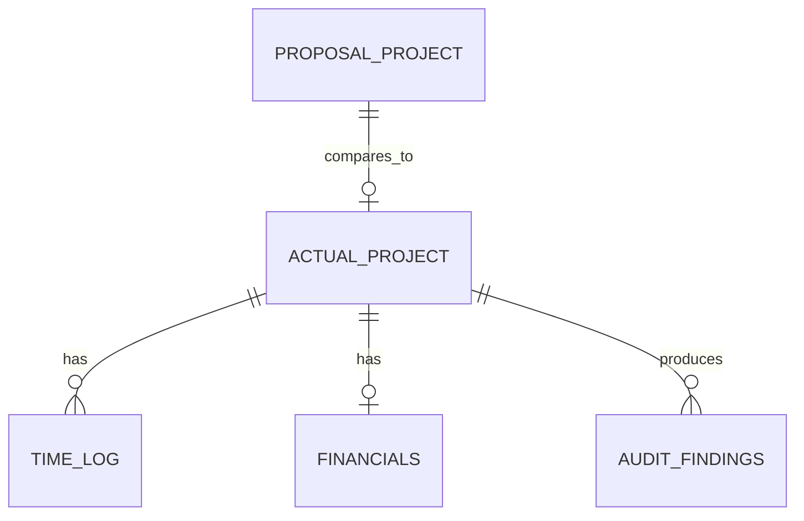

# epm-insights Data Dictionary

## Purpose

This data dictionary defines the first expected fields for epm-insights. The goal is to keep the audit engine consistent as proposal data, actual project data, financial data, and time logs are added.

Only synthetic or public-safe data should be committed to the repository.

## Core Tables

## Proposal Project

This table represents the expected state of the project before or during approval.

| Field | Description |
|---|---|
| project_number | Project identifier |
| project_title | Project name or title |
| description | Scope summary |
| client | Customer or account |
| project_manager | Responsible project manager |
| price_type | Fixed, T&E, or other pricing model |
| estimated_value | Expected project value |
| estimated_hours | Expected labor hours |
| planned_resources | Expected team or resource group |
| expected_rate | Expected labor rate or blended rate |
| start_date | Planned start date |
| end_date | Planned end date |
| status | Proposal, pre-approved, approved, active, paused, or completed |
| notes | Scope assumptions, exclusions, or review notes |

## Actual Project

This table represents the actual or current state of the project.

| Field | Description |
|---|---|
| project_number | Project identifier |
| project_title | Project name or title |
| po_number | Purchase order number |
| client | Customer or account |
| project_manager | Responsible project manager |
| price_type | Fixed, T&E, or other pricing model |
| total_value | Approved or current project value |
| balance_remaining | Remaining project balance |
| hours_remaining | Remaining project hours |
| billed_pct | Billing progress percentage |
| class_unit | Project class, business unit, or work type |
| site_location | Project site or location |
| start_date | Actual or current start date |
| end_date | Actual or expected end date |
| status | Approved, active, paused, completed, or closed |
| last_updated | Last update date |
| notes | Project notes |

## Financials

This table represents the financial view of the project.

| Field | Description |
|---|---|
| project_number | Project identifier |
| project_title | Project name or title |
| client | Customer or account |
| project_manager | Responsible project manager |
| price_type | Fixed, T&E, or other pricing model |
| total_value | Current project value |
| hours_budgeted | Budgeted labor hours |
| balance_remaining | Remaining project balance |
| po_number | Purchase order number |
| co_count | Change order count |
| class_unit | Project class, business unit, or work type |
| status | Project status |
| description | Scope summary |

## Time Log

This table represents labor activity by employee, project, and date.

| Field | Description |
|---|---|
| entry_date | Date of labor entry |
| employee_name | Employee or resource name |
| project_number | Project identifier |
| project_title | Project name or title |
| hours | Hours logged |
| task_note | Work note or task category |

## Audit Outputs

The audit engine should produce calculated fields that explain project performance.

| Field | Description |
|---|---|
| budget_variance_pct | Difference between expected and actual budget position |
| hours_variance_pct | Difference between expected and actual hours position |
| billing_position | Billing status compared with project progress |
| balance_position | Remaining balance status |
| schedule_position | Timeline status |
| resource_position | Resource usage status |
| change_order_position | Scope movement status |
| health_status | Green, yellow, or red project health |
| audit_summary | Short explanation of the project position |

## Data Rules

- Project numbers must be normalized before joining tables
- Dates should be stored in a consistent format
- Currency and hour fields should remain numeric
- Proposal data and actual data should stay separate until the audit comparison step
- Missing values should be flagged before audit metrics are calculated
- Real company data should not be committed to the repository

