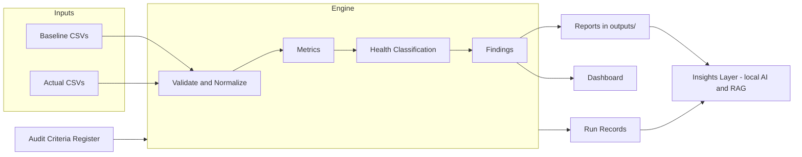

# epm-insights — Product Requirements Document (PRD)

## 1. Summary

epm-insights is a local, free, open-source audit and insights system for Engineering Program/Project Managers. It compares proposal baselines against actual performance for approved projects, classifies project health, and generates audit-ready reports. The audit process itself follows a documented Quality Framework so results are consistent, traceable, and verifiable by external auditors.

## 2. Users

| User | Description | When |
|---|---|---|
| Primary | Project owner (individual EPM) reviewing her own projects | Now |
| Secondary | Other engineering project managers at the same company | After the workflow is stable |
| Future | Broader team or organizational deployment | Design must not block this |

Expansion requirement: the audit engine must be a reusable package with no logic locked inside scripts or the dashboard, so future multi-user use (shared folder, internal server) requires no rewrite of audit logic.

## 3. Problem

Project performance review currently requires pulling estimates, hours, rates, resources, billing, deadlines, and change orders from multiple files, with no consistent evaluation logic between projects. Results are hard to compare, hard to defend, and the review process itself has no standard an external auditor could check against.

## 4. Goals

1. One repeatable workflow that audits every approved project with the same logic.
2. Deviation metrics and advisory health classification (Green/Yellow/Red) that are transparent and explainable.
3. Generated report files a PM can open, print, or share without any technical steps.
4. A documented Quality Framework governing the audit process, recognizable to external auditors.
5. Full traceability: every report reproducible from its run record.
6. Zero cost; all data stays on the user's machine.

## 5. Non-Goals

- Auditing projects before approval (proposal data is baseline input only).
- Punitive scoring — health colors are review signals, not judgments.
- Cloud hosting, external APIs, or any required internet connection.
- Replacing the PM's judgment with AI output.

## 6. Functional Requirements

### 6.1 Data and validation

- FR-1: Load proposal (baseline) and actual data from CSV files with documented schemas.
- FR-2: Validate required columns, dates, and statuses; report clear, plain-language errors.
- FR-3: Normalize project identifiers so baseline and actual records join reliably.
- FR-4: Only synthetic or public-safe data is ever committed to the repository; real data stays local and ignored by version control.

### 6.2 Audit engine

- FR-5: Compute deviation metrics: budget, hours, schedule, resources (and later rates, billing position, change-order impact).
- FR-6: Read all thresholds and formulas from a versioned Audit Criteria Register (config file), never hard-coded.
- FR-7: Classify advisory health (Green/Yellow/Red) using the criteria register.
- FR-8: Produce structured findings for the largest deviations.
- FR-9: Write a run record for every run: run ID, timestamp, criteria version, input file fingerprints, and code version.

### 6.3 Reporting

- FR-10: Generate a per-project audit report (HTML, printable to PDF) and a portfolio summary, saved to a local `outputs/` folder.
- FR-11: Reports state which criteria version produced them.
- FR-12: Report layout follows the report template defined in the docs.

### 6.4 Dashboard

- FR-13: Local dashboard (Streamlit) to browse projects, health status, deviations, and findings.
- FR-14: Filter by client, project manager, project type, and health.
- FR-15: Download/export the generated report files from the dashboard.

### 6.5 Intelligent insights (committed, built last)

- FR-16: Flag unusual patterns (anomalies in hours, billing, schedule).
- FR-17: Compare similar projects and track estimate accuracy over time.
- FR-18: Retrieval-assisted drafting (RAG): when drafting a report narrative, retrieve findings, closeout notes, and outcomes from similar past projects and cite which projects informed the draft.
- FR-19: All AI features run locally by default. Cloud AI is an explicit, per-use opt-in with a clear warning. AI never changes a metric or a health classification.

### 6.6 Quality Framework

- FR-20: Maintain the framework documents: Audit Charter, Roles and Responsibilities, Audit Criteria Register, Document and Record Control, Defined Process Steps, Calibration and Review Cycle, Findings and Corrective Action Log, External Audit Alignment Map.
- FR-21: The External Audit Alignment Map lets an external auditor map their checklist to this system without any restructuring on our side.
- FR-22: Criteria changes require a version bump and a short recorded reason.

## 7. Non-Functional Requirements

| Requirement | Rule |
|---|---|
| Cost | Free and open-source tools only |
| Privacy | All processing local; no data leaves the machine; no required network calls |
| Transparency | Every metric has a visible formula; every classification has a visible rule |
| Traceability | Any report can be reproduced from its run record |
| Testability | Deviation math and classification covered by automated tests |
| Simplicity | Runnable by a non-programmer: one command, or one dashboard click |

## 8. System Flow

## 9. Acceptance Criteria (per release slice)

1. **Completed-projects slice (this branch):** run one command on synthetic data → per-project HTML reports + summary + run record appear in `outputs/`; all tests pass.
2. **Framework slice:** all eight framework documents exist; criteria live in a versioned config the engine actually reads.
3. **Dashboard slice:** launch one command → browse and filter synthetic projects, download a report.
4. **Insights slice:** anomaly flags and similar-project comparison work on synthetic history; RAG drafting runs fully offline.

## 10. Risks

| Risk | Mitigation |
|---|---|
| Thresholds mislabel projects early on | Advisory colors, forgiving defaults, scheduled calibration reviews |
| Real data leaks into the repo | Synthetic-only rule, `.gitignore` for local data folders, review before commit |
| "Later" features never happen | All phases committed in the project plan with definition of done |
| AI output overrides audit logic | AI is additive only; metrics and health come exclusively from the engine |

## Project Ownership

Author and project owner: Syeda M. (smonowar@purdue.edu)
