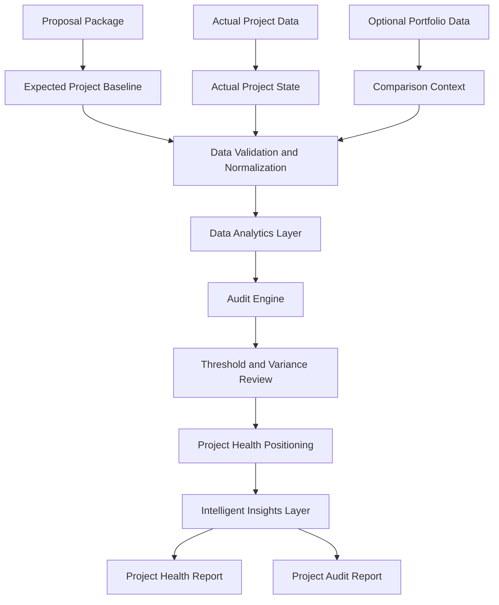

# epm-insights Project Overview

## Purpose

epm-insights is an Engineering Program/Project Management tool for auditing project and program performance in engineering and industrial automation environments.

I am building it to compare proposal expectations with actual performance, evaluate completed or paused work against defined audit metrics, and generate project health and post-mortem reports that are clear enough to use in real review conversations.

The focus is structured evaluation supported by data analytics and an intelligent insights layer. epm-insights is designed to show what was planned, what changed, where performance moved away from the original expectation, and what that means for future estimating, execution, project control, and program-level visibility.

## Core Problem

Engineering Program/Project Managers often need to understand whether work performed as expected. That review usually means checking estimates, hours, rates, resource usage, billing status, deadlines, change orders, and final outcomes across multiple files.

epm-insights brings that information into one workflow so I can review each project or program with the same structure and the same performance logic.

## Core Inputs

1. Proposal package
   - Expected budget
   - Estimated hours
   - Planned resources
   - Labor rates or team rates
   - Expected timeline
   - Scope assumptions
   - Optional baseline score

2. Actual project data
   - Actual hours
   - Actual billing or balance
   - Actual resource usage
   - Change orders
   - Project status
   - Completion or pause state

3. Optional portfolio data
   - Similar projects
   - Project type comparison
   - Company performance trends
   - Growth and workload patterns

## Core Outputs

1. Project health report
   - Current position
   - Risk level
   - Scorecard
   - Key project insights
   - Recommended actions

2. Project audit report
   - Proposal versus actual comparison
   - Variance analysis
   - Metric-by-metric audit
   - Lessons learned
   - Findings and recommendations

## System Layers

1. Expert Evaluation Framework
   - Defines what good project performance means
   - Converts Engineering Program/Project Management judgment into repeatable checks

2. Data Analytics Layer
   - Uses SQL and Python to clean, join, and calculate project metrics
   - Measures variance, thresholds, and health indicators

3. Audit Engine
   - Applies audit rules to expected and actual project data
   - Produces project positioning and findings

4. Reporting Layer
   - Generates project health summaries, audit reports, and post-mortem outputs

5. Intelligent Insights Layer
   - Uses AI and ML where they improve review quality
   - Supports anomaly detection, project similarity analysis, risk classification, and report drafting once the audit logic is stable

## System Workflow

## Future Prospects

Future versions may include:

- Local dashboard for daily and weekly project review
- PDF or Word report export
- Project similarity analysis
- Estimate accuracy tracking
- Resource workload analysis
- Risk classification using machine learning
- Anomaly detection for unusual hours, billing, or schedule patterns
- Report drafting support after the audit logic is stable

## Project Ownership

Author and project owner: Syeda
