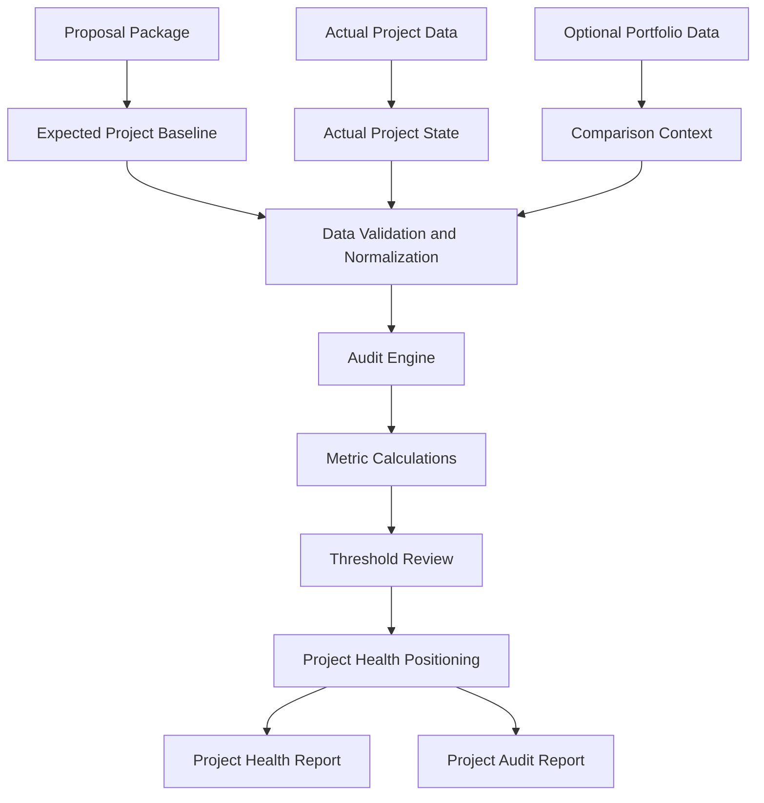

# EPM Insights Project Overview

## Purpose

EPM Insights is designed to help engineering project managers audit project performance using proposal expectations, actual project data, and standard project health metrics.

The project focuses on turning project records into a clear performance view. It is meant to show what was planned, what actually happened, where the variance occurred, and what should be carried forward into future estimating and execution.

## Target User

The first version is designed for individual project review. Once the workflow is stable, it can be shared with other engineering project managers for broader review and feedback.

## Core Problem

Engineering project managers often need to understand whether a project performed as expected. That review usually requires checking estimates, hours, rates, resource usage, billing status, deadlines, change orders, and final outcomes across multiple files.

EPM Insights brings that information into one local workflow so each project can be reviewed with the same structure and the same performance logic.

## Core Inputs

1. Proposal package
   - Expected budget
   - Estimated hours
   - Planned resources
   - Labor rates or team rates
   - Expected timeline
   - Scope assumptions
   - Optional baseline score

2. Actual project data
   - Actual hours
   - Actual billing or balance
   - Actual resource usage
   - Change orders
   - Project status
   - Completion or pause state

3. Optional portfolio data
   - Similar projects
   - Project type comparison
   - Company performance trends
   - Growth and workload patterns

## Core Outputs

1. Project health report
   - Current position
   - Risk level
   - Scorecard
   - Key project insights
   - Recommended actions

2. Project audit report
   - Proposal versus actual comparison
   - Variance analysis
   - Metric-by-metric audit
   - Lessons learned
   - Findings and recommendations

## System Workflow

## Future Prospects

Future versions may include:

- Local dashboard for daily and weekly project review
- PDF or Word report export
- Project similarity analysis
- Estimate accuracy tracking
- Resource workload analysis
- Risk classification using machine learning
- Anomaly detection for unusual hours, billing, or schedule patterns
- Optional local-only report assistance
