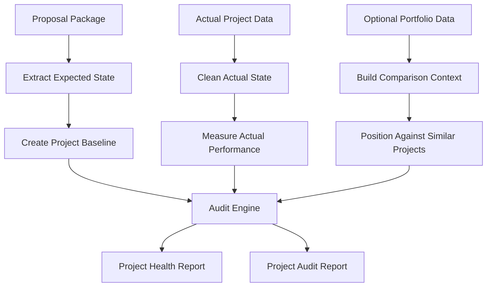

# EPM Insights Project Overview

## Purpose

EPM Insights is designed to help engineering project managers audit project performance using proposal expectations, actual project data, and standard project health metrics.

The project is both a practical tool and a learning path. It supports project analysis while building skills in SQL, Python, data analytics, project audit thinking, dashboarding, and applied machine learning.

## Target User

The first user is the project owner. The tool will be tested personally during development, then shared with other engineering project managers once the workflow is stable, useful, and trustworthy.

## Core Problem

Engineering project managers often need to understand whether a project performed as expected. That review usually requires checking estimates, hours, rates, resource usage, billing status, deadlines, change orders, and project outcomes across multiple files.

EPM Insights will bring that information into one local workflow so the project can be reviewed with structure and consistency.

## Core Inputs

1. Proposal package
   - Expected budget
   - Estimated hours
   - Planned resources
   - Labor rates or team rates
   - Expected timeline
   - Scope assumptions
   - Optional baseline score

2. Actual project data
   - Actual hours
   - Actual billing or balance
   - Actual resource usage
   - Change orders
   - Project status
   - Completion or pause state

3. Optional portfolio data
   - Similar projects
   - Project type comparison
   - Company performance trends
   - Growth and workload patterns

## Core Outputs

1. Project health report
   - Current position
   - Risk level
   - Scorecard
   - Key project insights
   - Recommended actions

2. Project audit report
   - Proposal versus actual comparison
   - Variance analysis
   - Metric-by-metric audit
   - Lessons learned
   - Findings and recommendations

## High-Level Workflow

## Future Prospects

Future versions may include:

- Local dashboard for daily and weekly project review
- PDF or Word report export
- Project similarity analysis
- Estimate accuracy tracking
- Resource workload analysis
- Risk classification using machine learning
- Anomaly detection for unusual hours, billing, or schedule patterns
- Optional local-only AI support for report drafting
