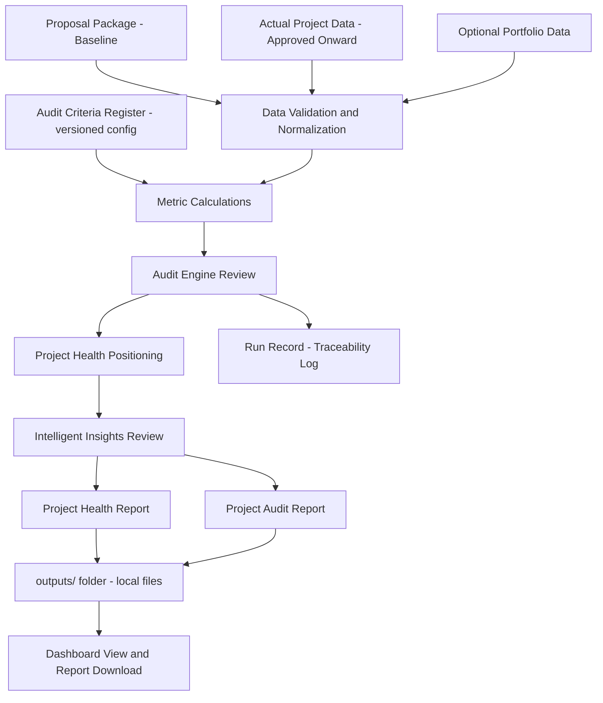

# epm-insights

## Project Overview

### Purpose

epm-insights is an AI-assisted project analysis and audit system for Engineering Program/Project Managers.

It compares proposal expectations with actual performance, evaluates approved work against defined audit criteria, and generates project health and post-mortem reports that are clear enough to use in real review conversations.

The focus is structured evaluation supported by data analytics and an intelligent insights layer. epm-insights shows what was planned, what changed, where performance moved away from the original expectation, and what that means for future estimating, execution, project control, and program-level visibility.

Every part of the system follows a documented Quality Framework so that the audit process itself is defined, controlled, measurable, and improvable. When an external auditor reviews the system, they can map their own checklist to it quickly using the External Audit Alignment Map.

### Audit Scope

The system audits projects from approval onward:

- `approved` → `active` → `paused` → `completed`

The proposal package is **not** an audited state. It is the **baseline**: the source of expected budget, hours, resources, rates, and timeline that approved projects are measured against.

### Target User

The first version is designed for individual project review by the project owner. The system is intentionally built so it can expand later: the audit engine is a reusable package, so the same logic can serve other engineering project managers, a shared team workflow, or a broader deployment without being rewritten.

### Core Problem

Engineering project managers often need to understand whether a project performed as expected. That review usually requires checking estimates, hours, rates, resource usage, billing status, deadlines, change orders, and final outcomes across multiple files.

epm-insights brings that information into one workflow so each project or program can be reviewed with the same structure and the same performance logic — and so the review process itself can withstand external audit.

### Core Inputs

1. Proposal package (baseline — not audited itself)
   - Expected budget
   - Estimated hours
   - Planned resources
   - Labor rates or team rates
   - Expected timeline
   - Scope assumptions
   - Optional baseline score

2. Actual project data (approved projects onward)
   - Actual hours
   - Actual billing or balance
   - Actual resource usage
   - Change orders
   - Project status
   - Completion or pause state

3. Optional portfolio data
   - Similar projects
   - Project type comparison
   - Company performance trends
   - Growth and workload patterns

### Core Outputs

1. Project health report
   - Current position
   - Risk level
   - Scorecard
   - Key project insights
   - Recommended actions

2. Project audit report
   - Proposal versus actual comparison
   - Variance analysis
   - Metric-by-metric audit
   - Lessons learned
   - Findings and recommendations

3. Run record (traceability)
   - Which input files, criteria version, and code produced each report
   - Allows any result to be reproduced and verified

All reports are generated locally into an `outputs/` folder on the user's own machine as shareable files (HTML/CSV). Nothing is uploaded anywhere.

## System Workflow



## Project State Model

```mermaid
stateDiagram-v2
    note left of Approved
        Proposal package exists
        before approval. It is the
        baseline for comparison,
        not an audited state.
    end note
    [*] --> Approved
    Approved --> Active
    Active --> Paused
    Paused --> Active
    Active --> Completed
    Completed --> AuditReady
    Paused --> AuditReady
    AuditReady --> ReportGenerated
    ReportGenerated --> [*]
```

## Quality Framework (Standardization)

The audit process is governed by a documented Quality Framework so the system stays consistent as it grows and so external auditors can verify it. Its elements:

| Element | What it is |
|---|---|
| Audit Charter | Defines what the audit system covers, its boundaries, and who relies on it |
| Roles and Responsibilities | Who owns criteria, approves reports, and reviews results |
| Audit Criteria Register | Versioned, machine-readable thresholds and formulas the engine reads |
| Document and Record Control | Register of controlled documents; retained run records for every audit run |
| Defined Process Steps | Each pipeline stage documented with inputs, outputs, and pass criteria |
| Calibration and Review Cycle | Scheduled review of thresholds and classifications against real outcomes |
| Findings and Corrective Action Log | Structured findings with follow-up status, not just report text |
| External Audit Alignment Map | Maps each element to the quality-management concepts external auditors assess |

## Related Documents

- `docs/prd.md` — product requirements (what the system must do)
- `docs/system-architecture.md` — how the system is built
- `docs/project-plan.md` — build phases and definition of done
- `docs/audit-engine-foundation.md` — audit logic foundations
- `docs/completed-project-health.md` — completed-projects MVP (first implemented slice)

### Future Prospects

Committed in the plan (see `docs/project-plan.md`), not optional ideas:

- Local dashboard for project review with report download
- Generated report files (HTML, printable to PDF)
- Project similarity analysis and estimate accuracy tracking
- Risk classification and anomaly detection
- Retrieval-assisted report drafting (RAG) over past project history — local-first, cloud only as explicit opt-in

## Project Ownership

Author and project owner: Syeda M. (smonowar@purdue.edu)
