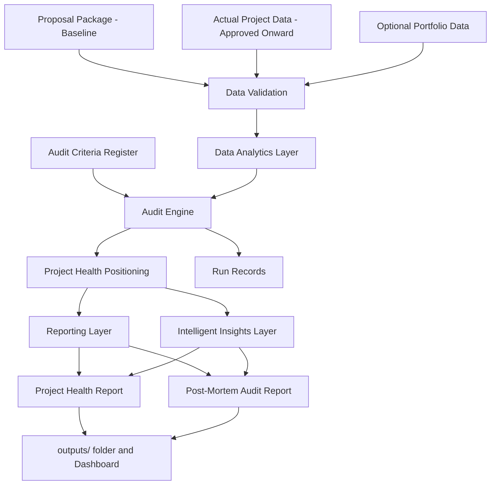

# epm-insights

## Project Plan

### Purpose

This plan defines how epm-insights will be built, in order, with a definition of done for every phase. Every phase in this plan is committed work, not an optional idea — nothing here is "maybe later."

The audit scope covers approved projects onward (`approved` → `active` → `paused` → `completed`). Proposal data is the baseline input, not an audited state.

### Build Strategy

The system is built in layers, and each layer must be useful on its own before the next layer depends on it:

1. Data foundation
2. Audit engine
3. Reporting workflow
4. Dashboard
5. Intelligent insights layer

One track runs through **all** phases: the Quality Framework (Track Q below). It is not a phase that can be skipped or deferred — every phase has framework deliverables.

### System Workflow



### Track Q: Quality Framework (runs through every phase)

Goal: the audit process itself is defined, controlled, measurable, and improvable — recognizable to any external auditor via the External Audit Alignment Map.

Deliverables (live in `docs/quality-framework/`):

- Audit Charter: system scope, boundaries, interested parties
- Roles and Responsibilities: who owns criteria, approves reports, reviews results
- Audit Criteria Register: versioned config (`config/audit_criteria.yaml`) — the only place thresholds live; every change gets a version bump and a recorded reason
- Document and Record Control: register of controlled documents; run records retained for every audit run
- Defined Process Steps: each pipeline stage with inputs, outputs, and pass criteria
- Calibration and Review Cycle: scheduled threshold reviews against real outcomes
- Findings and Corrective Action Log: structured findings with follow-up status
- External Audit Alignment Map: maps each element to the quality-management concepts external auditors assess

Definition of done: all eight documents exist, the engine reads criteria only from the register, and every run leaves a run record.

### Phase 1: Data Foundation

Goal: the data structures the audit engine depends on.

Work items:

- Define required input files and documented schemas
- Update the data dictionary
- Standardize project identifiers
- Separate baseline (proposal) data from actual data
- Create synthetic sample data covering approved, active, paused, and completed projects — including completed-project files with a realistic Green/Yellow/Red mix
- Keep real company data outside version control (git-ignored local folders)

Definition of done: synthetic data loads and validates cleanly; schemas documented; the completed-projects pipeline has runnable sample data.

### Phase 2: Audit Engine

Goal: the logic that evaluates project and program performance, as a reusable package.

Work items:

- Move audit logic into `src/epm_insights/` (package, not loose scripts)
- Calculate budget, hours, schedule, and resource deviations (first slice: completed projects)
- Read thresholds from the Audit Criteria Register
- Assign advisory health status (Green/Yellow/Red)
- Generate structured findings
- Write run records (run ID, timestamp, criteria version, input fingerprints)
- Add automated tests with known answers for every metric and every classification boundary
- Extend to in-flight metrics for active/paused projects: billed percentage, balance remaining, burn rate, deadline position, change-order impact

Definition of done: one command audits the synthetic data end to end; all tests pass; results are reproducible from the run record.

### Phase 3: Reporting Workflow

Goal: audit results become shareable review documents, automatically.

Work items:

- Generate a per-project audit report (HTML, printable to PDF) from the report template
- Generate a portfolio summary report
- Reports state the criteria version that produced them
- Separate findings, risks, and recommendations in the layout
- Save everything to the local `outputs/` folder

Definition of done: one command produces polished report files a non-programmer can open, print, and share.

### Phase 4: Dashboard

Goal: make the system usable without the command line.

Work items:

- Local Streamlit dashboard: select data, run the audit, view health and deviations
- Filter by project, client, project manager, project type, and health
- Show findings and metric detail per project
- Download generated report files from the dashboard

Definition of done: one command launches the dashboard; a non-programmer can run an audit and download a report with clicks only.

### Phase 5: Intelligent Insights Layer

Goal: intelligent support where it improves review quality — committed scope, not an idea list.

Work items:

- Anomaly flags for unusual hours, billing, or schedule patterns
- Similar-project comparison and estimate accuracy tracking over time
- Risk classification support
- Retrieval-assisted drafting (RAG): when drafting a post-mortem narrative, retrieve findings, closeout notes, and outcomes from similar past projects and cite which projects informed the draft
- All AI features run locally by default; cloud AI is explicit per-use opt-in; AI never changes a metric or health classification

Definition of done: insights run fully offline on synthetic history; every AI-assisted draft cites its sources; audit numbers remain byte-identical with insights on or off.

## Project State Model

```mermaid
stateDiagram-v2
    note left of Approved
        Proposal data before approval
        is the comparison baseline,
        not an audited state.
    end note
    [*] --> Approved
    Approved --> Active
    Active --> Paused
    Paused --> Active
    Active --> Completed
    Completed --> AuditReady
    Paused --> AuditReady
    AuditReady --> ReportGenerated
    ReportGenerated --> [*]
```

## Plan Maintenance

This plan and the overview are living documents. As modifications accumulate during the build, the plan, overview, and PRD get revised together near the end of each phase so they always describe the real system.

## Project Ownership

Author and project owner: Syeda M. (smonowar@purdue.edu)
