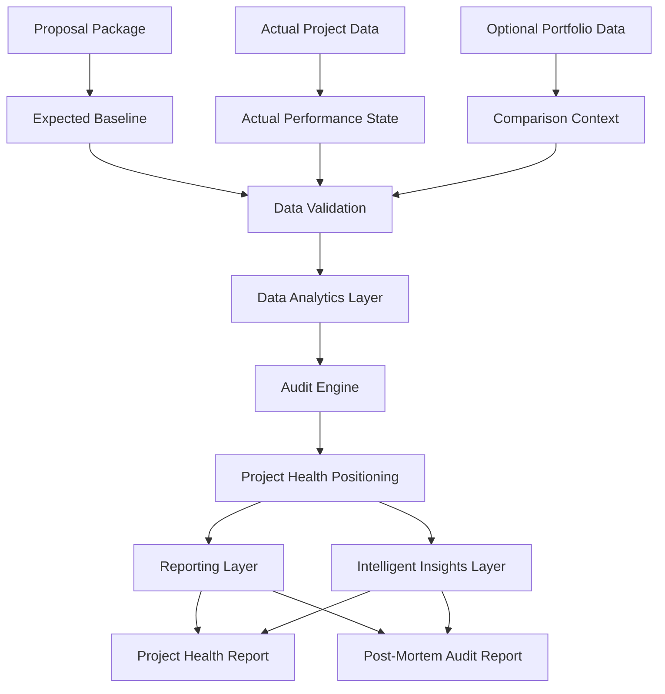
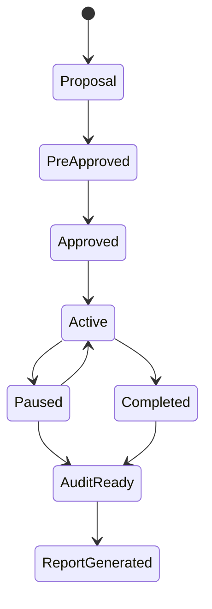

# epm-insights Project Plan

## Purpose

This plan defines how I will build epm-insights in practical phases. The project starts with the audit engine because the evaluation logic needs to be solid before the dashboard, reports, or intelligent insights layer can be useful.

epm-insights is an Engineering Program/Project Management audit and evaluation system for engineering and industrial automation projects.

## Build Strategy

I will build the system in layers:

1. Data foundation
2. Audit engine
3. Reporting workflow
4. Dashboard
5. Intelligent insights layer

Each layer should be useful on its own before the next layer depends on it.

## System Workflow

## Phase 1: Data Foundation

Goal: prepare the data structure that the audit engine will depend on.

Work items:

- Define required input files
- Create a data dictionary
- Standardize project identifiers
- Separate proposal data from actual data
- Keep synthetic data safe for public use
- Keep real company data outside version control

Expected output:

- A clear schema for proposal, actual, financial, and time-entry data
- A repeatable data loading path

## Phase 2: Audit Engine

Goal: create the logic that evaluates project and program performance.

Work items:

- Calculate budget variance
- Calculate hours variance
- Review billing position
- Review balance remaining
- Review resource usage
- Review schedule position
- Review change order impact
- Assign project health status
- Generate audit findings

Expected output:

- A repeatable project health score
- A basic audit summary for each project

## Phase 3: Reporting Workflow

Goal: turn audit results into useful review outputs.

Work items:

- Create a project health summary
- Create a post-mortem audit report
- Separate findings, risks, and recommendations
- Make outputs clear enough for project review conversations

Expected output:

- Project health report
- Project audit report

## Phase 4: Dashboard

Goal: make the audit engine easier to use and review.

Work items:

- Add file upload or sample data selection
- Show project health status
- Show key metrics and variance
- Show audit findings
- Add filtering by project, client, project manager, and project type

Expected output:

- A working dashboard for reviewing project and program performance

## Phase 5: Intelligent Insights Layer

Goal: add intelligent support only where it improves the quality of project review.

Work items:

- Identify unusual project patterns
- Compare similar projects
- Support risk classification
- Support report drafting
- Test AI and ML features against transparent audit logic

Expected output:

- Intelligent insights that support, not replace, the audit engine

## Project State Model

## Commit Plan

I will keep commits small enough to show real progress.

Suggested commit sequence:

1. Added project plan
2. Added data dictionary
3. Added sample data structure
4. Created first SQL load script
5. Added project ID normalization query
6. Added budget audit checks
7. Added hours audit checks
8. Added first project health rules
9. Created first audit summary output
10. Added dashboard foundation

## Project Ownership

Author and project owner: Syeda

