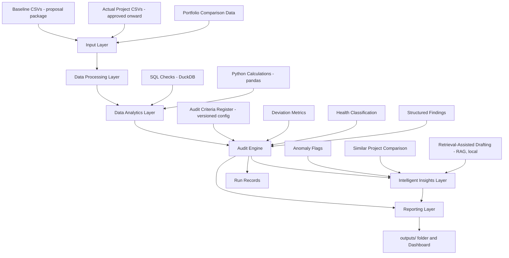
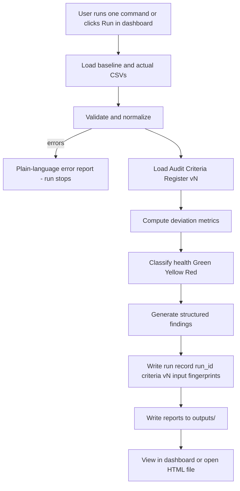
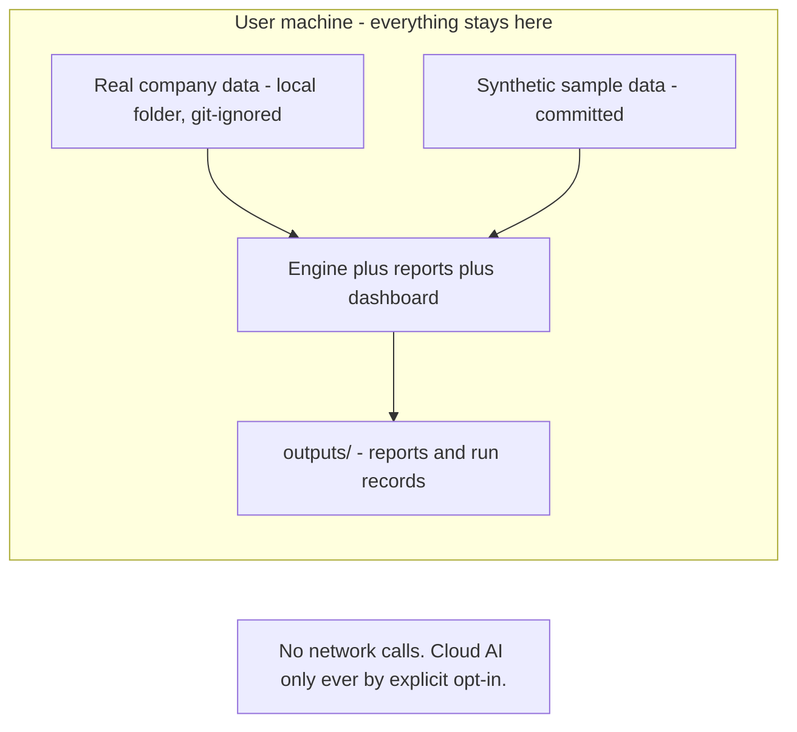

# epm-insights — System Architecture

## 1. Design Principles

1. **Local-first.** Everything runs on the user's own machine. No cloud services, no external API calls, no required internet connection.
2. **Free.** Python, pandas, DuckDB, Streamlit, pytest — all free and open-source.
3. **Transparent math.** Every metric is a visible formula; every health color is a visible rule read from a versioned criteria file.
4. **Traceable.** Every run writes a run record, so any report can be reproduced and verified.
5. **Engine as a package.** All audit logic lives in one reusable package; the command line, reports, dashboard, and insights layer are thin consumers of it. This is what allows expansion to more users later without a rewrite.
6. **AI is additive.** The insights layer can explain, compare, and draft — it can never change a metric or a health classification.

## 2. Layer View



## 3. Components

| Component | Technology | Role |
|---|---|---|
| Input layer | CSV files | Baseline, actuals, portfolio data; documented schemas in the data dictionary |
| Validation | Python (pandas) | Required columns, date parsing, status checks, ID normalization |
| Analytics | DuckDB SQL + pandas | Deviation metrics; SQL and Python implementations mirror each other |
| Audit Criteria Register | YAML config, versioned | Thresholds and formula parameters; the only source of criteria |
| Audit engine | Python package (`src/epm_insights/`) | Metrics → health classification → findings → run record |
| Run records | JSON files in `outputs/runs/` | Run ID, timestamp, criteria version, input fingerprints |
| Reporting | Python + HTML templates | Per-project report and portfolio summary written to `outputs/` |
| Dashboard | Streamlit (local) | Browse, filter, and download reports |
| Insights layer | Local models only by default | Anomalies, similarity, RAG drafting over past run records and reports |
| Tests | pytest | Known-answer tests for metrics and classification |

## 4. Data Flow (single audit run)



## 5. Project State Model (audit scope)

```mermaid
stateDiagram-v2
    note left of Approved
        Pre-approval proposal data
        is the baseline input,
        not an audited state.
    end note
    [*] --> Approved
    Approved --> Active
    Active --> Paused
    Paused --> Active
    Active --> Completed
    Completed --> AuditReady
    Paused --> AuditReady
    AuditReady --> ReportGenerated
    ReportGenerated --> [*]
```

The first implemented slice audits `completed` (and compatible `closed`) projects. Active and paused auditing reuse the same engine with additional in-flight metrics (burn rate, billed position, deadline pressure).

## 6. Repository Layout (target)

```text
epm-insights/
  README.md
  docs/
    project-overview.md
    prd.md
    system-architecture.md
    project-plan.md
    audit-engine-foundation.md
    completed-project-health.md
    data-dictionary.md
    quality-framework/        # charter, roles, criteria register notes,
                              # process steps, review cycle, findings log,
                              # external audit alignment map
  config/
    audit_criteria.yaml       # versioned criteria register
  data/
    sample/                   # synthetic data only
  sql/
  scripts/                    # thin command-line entry points
  src/
    epm_insights/
      data/                   # loading, validation, normalization
      audit/                  # metrics, classification, findings
      reports/                # report generation
      app/                    # dashboard
      insights/               # anomalies, similarity, RAG (local)
  tests/
  outputs/                    # generated locally, not committed
```

## 7. Privacy Boundary



The repository only ever contains synthetic data. Real data is used by pointing the same commands at local files that git ignores.

## Project Ownership

Author and project owner: Syeda M. (smonowar@purdue.edu)
